# Tetris-Lite: Reinforcement Learning from First Principles

## Final Development Report

---

## 1. Problem Formulation

### 1.1 The Tetris MDP

We formulate Tetris as a **Markov Decision Process** (MDP), defined by the tuple $(\mathcal{S}, \mathcal{A}, P, R, \gamma)$:

| Symbol | Meaning |
|--------|---------|
| $\mathcal{S}$ | State space |
| $\mathcal{A}$ | Action space |
| $P(s' \mid s, a)$ | Transition probability |
| $R(s, a, s')$ | Reward function |
| $\gamma \in [0,1)$ | Discount factor |

### 1.2 Markov Property Justification

The **Markov property** requires that the future is conditionally independent of the past given the present:

$$P(s_{t+1} \mid s_t, a_t, s_{t-1}, a_{t-1}, \ldots) = P(s_{t+1} \mid s_t, a_t)$$

Our state representation satisfies this because it contains all information necessary to determine the next state:

- **Board grid** $B \in \{0,1\}^{20 \times 6}$ -- full occupancy map (determines collision physics and line clears)
- **Current piece** $p_t \in \{1, \ldots, 7\}$ -- one-hot encoded (determines available placements)
- **Next piece** $p_{t+1} \in \{1, \ldots, 7\}$ -- one-hot encoded (for lookahead planning)

Given $(B_t, p_t, p_{t+1})$ and action $a_t = (\text{rotation}, \text{column})$, the next state $(B_{t+1}, p_{t+1}, p_{t+2})$ is **fully determined** except for the random draw of $p_{t+2}$, which is drawn i.i.d. uniformly from $\{1, \ldots, 7\}$ and is independent of history. The transition dynamics are:

$$s_{t+1} = f(s_t, a_t, \xi_{t+1}), \quad \xi_{t+1} \sim \text{Uniform}\{1, \ldots, 7\}$$

where $f$ is the deterministic placement-and-clear function and $\xi_{t+1}$ is the next-next piece. No past states influence this -- the Markov property holds exactly.

### 1.3 State and Action Spaces

**Observation** (35 dimensions):

$$\phi(s) = [\underbrace{h_1, \ldots, h_6}_{\text{height map (6)}}, \underbrace{c_1, \ldots, c_6}_{\text{holes per col (6)}}, \underbrace{f_1, \ldots, f_6}_{\text{bottom row fills (6)}}, \underbrace{h_{\max}, n_{\text{holes}}, b}_{\text{scalars (3)}}, \underbrace{e_p, e_{p'}}_{\text{piece one-hots (14)}}]$$

All features are normalised to $[0, 1]$.

**Action space**: Up to 34 discrete actions (piece-dependent), each encoding a (rotation, column) pair. State-dependent **legal action masking** restricts actions to those that don't immediately top out.

### 1.4 CNN Observation (PPO)

For the CNN policy, the board is represented as a raw binary grid:

$$B^{\text{cnn}} \in \{0, 1\}^{1 \times 20 \times 6}$$

concatenated with a 14-dimensional piece vector (current + next piece one-hots).

---

## 2. Algorithms

### 2.1 REINFORCE (Vanilla Policy Gradient)

REINFORCE is a Monte Carlo policy gradient method. The agent parameterises a stochastic policy $\pi_\theta(a \mid s)$ and optimises it by ascending the gradient of expected return.

**Policy Gradient Theorem:**

$$\nabla_\theta J(\theta) = \mathbb{E}_{\pi_\theta}\left[\sum_{t=0}^{T} \nabla_\theta \log \pi_\theta(a_t \mid s_t) \cdot G_t\right]$$

where $G_t$ is the **Monte Carlo return** from time $t$:

$$G_t = \sum_{k=0}^{T-t} \gamma^k r_{t+k}$$

**Variance reduction** -- we subtract a baseline $b$ (the mean return over the episode):

$$\nabla_\theta J(\theta) \approx \frac{1}{T}\sum_{t=0}^{T} \nabla_\theta \log \pi_\theta(a_t \mid s_t) \cdot (G_t - b)$$

The baseline does not bias the gradient (since $\mathbb{E}[\nabla_\theta \log \pi_\theta \cdot b] = 0$) but reduces variance.

**Loss function** (with entropy bonus):

$$\mathcal{L}_{\text{REINFORCE}} = -\frac{1}{T}\sum_t \log \pi_\theta(a_t \mid s_t)(G_t - \bar{G}) - \beta H[\pi_\theta]$$

where $H[\pi_\theta] = -\sum_a \pi_\theta(a \mid s) \log \pi_\theta(a \mid s)$ is the entropy.

**Key property**: REINFORCE does **not** use temporal-difference (TD) learning. It waits for episodes to finish, computes full Monte Carlo returns, and updates in hindsight. No bootstrapping is involved.

### 2.2 PPO (Proximal Policy Optimization)

PPO improves upon REINFORCE in three fundamental ways:

1. **Advantage estimation** via GAE instead of raw returns
2. **Clipped surrogate objective** for stable policy updates
3. **Multiple epochs** of minibatch updates on the same rollout

**Clipped Surrogate Objective:**

$$\mathcal{L}^{\text{CLIP}}(\theta) = \mathbb{E}_t\left[\min\left(r_t(\theta)\hat{A}_t, \; \text{clip}(r_t(\theta), 1-\epsilon, 1+\epsilon)\hat{A}_t\right)\right]$$

where the probability ratio is:

$$r_t(\theta) = \frac{\pi_\theta(a_t \mid s_t)}{\pi_{\theta_{\text{old}}}(a_t \mid s_t)}$$

and $\epsilon = 0.2$ is the clipping parameter.

**Generalised Advantage Estimation (GAE):**

GAE blends TD residuals at different horizons using parameter $\lambda$:

$$\hat{A}_t^{\text{GAE}(\gamma, \lambda)} = \sum_{l=0}^{T-t} (\gamma\lambda)^l \delta_{t+l}$$

where the TD residual is:

$$\delta_t = r_t + \gamma V(s_{t+1}) - V(s_t)$$

This is computed recursively (backwards through time):

$$\hat{A}_t = \delta_t + \gamma\lambda(1-d_{t+1})\hat{A}_{t+1}$$

where $d_t$ is the done flag (1 if episode ended, 0 otherwise).

**Target returns** for value fitting:

$$\hat{R}_t = \hat{A}_t + V(s_t)$$

**PPO uses TD learning**: unlike REINFORCE, PPO bootstraps from value estimates $V(s_{t+1})$ through GAE. This is the core of TD -- using estimated future values instead of waiting for episode completion.

**Approximate KL divergence** (diagnostic, used for early stopping):

$$\text{KL}_{\text{approx}} = \mathbb{E}_t\left[\log \pi_{\theta_{\text{old}}}(a_t \mid s_t) - \log \pi_\theta(a_t \mid s_t)\right]$$

If the mean KL after any epoch exceeds a threshold $\text{KL}_{\text{target}} = 0.02$, remaining PPO epochs are skipped, preventing destructively large policy updates.

### 2.3 Action Masking

Illegal actions (placements that would immediately top out) are masked by setting their logits to $-10^8$ before the softmax:

$$\text{logits}'_a = \begin{cases} \text{logits}_a & \text{if } a \in \mathcal{A}_{\text{legal}}(s) \\ \text{logits}_a - 10^8 & \text{otherwise} \end{cases}$$

This ensures $\pi_\theta(a \mid s) \approx 0$ for illegal actions without breaking differentiability.

### 2.4 Entropy Regularisation

To prevent premature convergence to a deterministic policy, we add an entropy bonus:

$$\mathcal{L}_{\text{total}} = \mathcal{L}^{\text{CLIP}} - \beta \cdot H[\pi_\theta]$$

The coefficient $\beta$ is **linearly annealed** during training:

$$\beta(t) = \beta_{\text{start}} + (\beta_{\text{end}} - \beta_{\text{start}}) \cdot \frac{t}{T_{\text{total}}}$$

---

## 3. Architecture

### 3.1 REINFORCE: Shared MLP

```
obs(35) --> Linear(35, 256) --> ReLU --> Linear(256, 256) --> ReLU --> Linear(256, 256) --> ReLU
    |-- policy_head: Linear(256, 34) --> logits
    +-- value_head:  Linear(256, 1)  --> V(s)
```

Both policy and value share the same backbone. The value head is used for the baseline but is not critical (REINFORCE uses mean return as baseline, not $V(s)$).

### 3.2 PPO: Separated Architecture (Configurable)

After diagnosing shared-backbone gradient conflicts (see Section 5), we separated policy and value into independent components. The architecture is **configurable at the command line** (`--policy cnn|mlp --value mlp|linear`).

#### Policy Networks (choose one)

**Option A -- CNN Policy (`--policy cnn`, default):**

```
board(1, 20, 6) --> Conv2d(1->32, k=3, pad=1) --> ReLU
                --> Conv2d(32->64, k=3, stride=2, pad=1) --> ReLU
                --> Conv2d(64->64, k=3, pad=1) --> ReLU
                --> flatten(1920)
concat with piece_info(14) --> Linear(1934, 256) --> ReLU --> Linear(256, 34) --> logits
```

The CNN processes the raw $20 \times 6$ board with **spatial inductive bias** -- convolutional filters detect patterns like filled rows, holes, and column transitions that are naturally spatial.

**Option B -- MLP Policy (`--policy mlp`):**

```
obs(35) --> Linear(35, 256) --> ReLU --> Linear(256, 256) --> ReLU --> Linear(256, 256) --> ReLU --> Linear(256, 34) --> logits
```

A 3-hidden-layer MLP operating on the flat 35-dim engineered features. Logits-only (no value head) -- same contract as the CNN policy. Faster per step (no 2D convolutions), but lacks spatial inductive bias.

#### Value Estimators (choose one)

**Option A -- MLP Value (`--value mlp`, default):**

```
obs(35) --> Linear(35, 128) --> ReLU --> Linear(128, 64) --> ReLU --> Linear(64, 1) --> V(s)
```

Trained with Adam (lr $= 10^{-3}$), MSE loss, gradient clipping at 0.5. Separate optimizer from the policy -- no gradient interference.

**Option B -- Linear Value (`--value linear`):**

$$V(s) = \mathbf{w}^\top \phi(s) + b$$

Fitted by closed-form ridge regression:

$$\mathbf{w}^* = (\mathbf{X}^\top\mathbf{X} + \lambda\mathbf{I})^{-1}\mathbf{X}^\top\mathbf{y}$$

where $\mathbf{X}$ is the matrix of feature vectors $\phi(s)$ and $\mathbf{y}$ is the vector of GAE target returns. Regularisation $\lambda = 10^{-4}$ prevents ill-conditioning. One-shot solve per rollout -- zero interference with the policy, no gradient descent.

**Why separate policy and value?** The value loss gradient was 750$\times$ larger than the policy gradient through the shared backbone, drowning the policy signal (see Section 5.4). Separation eliminates this interference entirely.

---

## 4. Reward Function

### 4.1 Design Philosophy

The reward function uses **delta-based shaping** -- penalties are based on the *change* in board metrics, not absolute values. This is critical because absolute penalties create a growing baseline that drowns the actual learning signal.

$$r_t = r_{\text{lines}} + r_{\text{survival}} + r_{\Delta\text{holes}} + r_{\Delta\text{bump}} + r_{\Delta\text{height}} + r_{\text{game over}}$$

### 4.2 Components

| Component | Formula | Weight |
|-----------|---------|--------|
| Line clear | $n^2 \cdot w_{\text{line}}$ (quadratic in lines cleared) | $w_{\text{line}} = 60.0$ |
| Survival | $+1.0$ per step | $1.0$ |
| Hole penalty | $-w_h \cdot \max(\Delta h, 0)$ | $w_h = 1.5$ |
| Hole removal | $+w_{hr} \cdot \max(-\Delta h, 0)$ | $w_{hr} = 0.5$ |
| Bumpiness | $-w_b \cdot \max(\Delta b, 0)$ | $w_b = 0.3$ |
| Height | $-w_{ht} \cdot \max(\Delta\text{agg}, 0)$ | $w_{ht} = 0.3$ |
| Game over | $-w_{\text{go}}$ | $w_{\text{go}} = 10.0$ |

The quadratic bonus $n^2$ for line clears rewards multi-line clears disproportionately: a double is worth $4\times$, a triple $9\times$, and a quad $16\times$ a single.

---

## 5. Development History -- Iteration by Iteration

### 5.1 Iteration 1: Initial Implementation & Validation

**What we did:** Read and validated all source files (`tetris_env.py`, `agents.py`) for correctness.

**Environment findings:**
- Documentation incorrectly stated 33-dim observation (actual: 35) and 34 max actions (actual: piece-dependent, up to 34)
- Dead code in random action selection (unreachable branch)
- **No bugs** in environment logic

**Agent findings:**
- REINFORCE implementation was correct
- **Critical bug in PPO**: GAE bootstrapping (see next iteration)

### 5.2 Iteration 2: GAE Bootstrap Bug Fix

**The bug:** When a rollout was truncated mid-episode (the rollout budget of 4096 steps was exhausted before the episode ended), `compute_gae()` was called with `last_value = 0.0`:

```python
# BUGGY -- treats truncation as if episode ended with zero future value
advantages, returns = compute_gae(rew_t, val_t, done_t, gamma, lam, last_value=0.0)
```

**Why this matters:** At truncation, the episode is *not* over -- the agent will continue collecting reward. Setting `last_value = 0.0` tells GAE that all future returns are zero, which creates a large negative TD error at the truncation boundary:

$$\delta_T = r_T + \gamma \cdot \underbrace{0.0}_{\text{should be } V(s_{T+1})} - V(s_T) \approx r_T - V(s_T)$$

If $V(s_T) \approx 50$, this creates $\delta_T \approx -49$, severely biasing the advantage estimates.

**The fix:** After the rollout loop, compute $V(s_{\text{next}})$ if the episode was not done, and pass it to `compute_gae()`:

```python
last_val = 0.0
if not done:
    _, _, last_val = agent.select_action(obs, mask, env=env)
stats = agent.update(buf, last_value=last_val)
```

**Verification:** Advantage at truncation boundary changed from $-49.0$ (buggy) to $+0.5$ (correct).

### 5.3 Iteration 3: Reward Scale Problem

**Symptom:** After fixing the bootstrap bug, training plots showed extremely poor learning -- high-variance returns and an unstable value function.

**Diagnosis:** The original reward weights were tuned for a 10-wide Tetris board but our board is only 6 columns wide:

| Weight | Original (10-wide) | Problem on 6-wide |
|--------|-------------------|--------------------|
| `line_clear_scale` | 200 | Creates return range $[-408, +716]$ |
| `hole_penalty` | 4.0 | Too punitive -- holes are frequent on narrow board |
| `bumpiness_penalty` | 1.0 | Excessively large for 6 columns |

**Consequence:** Value loss ranged from 10,000 to 45,000. Through the shared backbone, the value gradient dominated:

$$\|\nabla_\theta \mathcal{L}_{\text{value}}\| \gg \|\nabla_\theta \mathcal{L}_{\text{policy}}\|$$

The policy was barely learning -- its gradients were washed out.

**Fix (first pass):** Reduced all weights proportionally:

| Weight | Before | After |
|--------|--------|-------|
| `line_clear_scale` | 200 | 30 |
| `hole_penalty` | 4.0 | 1.5 |
| `bumpiness_penalty` | 1.0 | 0.3 |
| `height_penalty` | 1.0 | 0.3 |
| `game_over_penalty` | 10.0 | 10.0 |

**Result:** Value loss dropped approximately $23\times$. Training became more stable.

### 5.4 Iteration 4: Entropy Collapse

**Symptom:** After the reward fix, entropy collapsed from $\sim 2.5$ to $\sim 0.2$ by iteration 75. The policy was converging to a near-deterministic strategy far too early.

**Root cause -- gradient magnitude analysis:**

With the shared backbone, both policy and value losses produce gradients through the same weights. The effective gradient contribution was:

$$\nabla_\theta \mathcal{L}_{\text{total}} = \nabla_\theta \mathcal{L}_{\text{policy}} + c_v \cdot \nabla_\theta \mathcal{L}_{\text{value}} - \beta \cdot \nabla_\theta H$$

At the time: $c_v = 0.5$ (value coefficient), $\beta = 0.05$ (entropy coefficient).

The entropy gradient magnitude was approximately:

$$\|\beta \cdot \nabla H\| \approx 0.05 \times 2.0 = 0.1$$

The value gradient magnitude was approximately:

$$\|c_v \cdot \nabla \mathcal{L}_v\| \approx 0.5 \times 150 = 75$$

**Ratio: $\frac{75}{0.1} = 750\times$**. The entropy bonus was completely overwhelmed.

**Fix:** Adjusted hyperparameters to rebalance the gradient contributions:

| Parameter | Before | After | Rationale |
|-----------|--------|-------|-----------|
| `ENT_START` | 0.05 | 0.20 | 4$\times$ stronger entropy encouragement early |
| `ENT_END` | 0.005 | 0.02 | Maintain meaningful exploration throughout |
| `vf_coef` | 0.5 | 0.25 | Halve the value gradient magnitude |

### 5.5 Iteration 5: Architectural Separation -- CNN Policy + Separate Value

**Motivation:** Even after rebalancing coefficients, the shared backbone remained fundamentally problematic -- value and policy gradients compete for the same parameters. This is a well-known issue in actor-critic methods.

**Solution:** Complete architectural separation:

1. **Policy network** $\to$ **CNN** -- processes the raw board grid with spatial convolutional filters. The board has inherent 2D structure (rows, columns, adjacency) that MLPs cannot exploit.

2. **Value estimator** $\to$ **Separate module** (initially linear ridge regression):
   - No neural network, no gradient descent. One-shot closed-form solve per rollout.
   - Zero interference with the policy -- completely eliminates the gradient conflict.

**Why CNN for policy?** The policy must decide *where* to place a piece -- a fundamentally spatial decision. Convolutional filters detect patterns like:
- Nearly-complete rows ($\to$ place to clear)
- Holes beneath blocks ($\to$ avoid creating more)
- Column height differences ($\to$ keep surface flat)

An MLP on the 35-dim engineered features loses this spatial structure.

**Why simple value estimator?** The value function $V(s)$ only needs to predict the expected future return -- a single scalar. It doesn't need to make spatial decisions. A linear model on the compact 35-dim features is sufficient and avoids overfitting.

**Result:** Line clear scale increased from 30 to 60 (now feasible with separated architecture). Training stabilised.

### 5.6 Iteration 6: MPS Backend Attempt and Reversion

**Motivation:** Apple Silicon (M-series) Macs have the MPS backend for GPU-accelerated PyTorch. We investigated whether it could accelerate training.

**What was tried:**

1. Profiled MPS vs CPU performance. Result: MPS rollout took 14 seconds per iteration (93% spent in inference due to per-step synchronisation), while CPU took 1.8 seconds.

2. **Root cause:** Each `agent.select_action()` call is a single forward pass through the policy. On MPS, every `.item()` call forces a CPU-GPU synchronisation barrier. With 4096 steps per iteration, that's 4096 sync points -- the GPU never gets to batch its work.

3. **Attempted fix:** Created a CPU mirror of the policy (`_policy_cpu`) for inference during rollouts, then trained the GPU copy. Result: MPS 6.5s vs CPU 5.5s. CPU was still faster.

**Decision:** Reverted the CPU-mirror approach. Disabled MPS entirely in `get_device()` (CUDA $\to$ CPU only). For small per-step inference workloads, CPU is faster than MPS.

**Lesson:** GPU acceleration requires batch parallelism. Per-step RL inference (single observation $\to$ single action) is inherently sequential and sync-bound on GPU backends.

### 5.7 Iteration 7: Performance Optimisation -- Height-Map Collision Detection

**Motivation:** Profiling revealed that `_can_place()` was the most expensive function in the rollout loop. Called once per action per step (up to 34 actions $\times$ 4096 steps = 140,000 calls per iteration), it used $O(H)$ column scanning for each collision check.

**The optimisation:** Replaced the per-action column scan with a precomputed **height map**:

1. **`_height_map()`** -- computed once per step using vectorised `argmax`:
   ```python
   has_block = (self.board != 0)
   first_occ = has_block.argmax(axis=0)
   col_has_any = has_block.any(axis=0)
   hmap = np.where(col_has_any, self.height - first_occ, 0)
   ```

2. **`_can_place_fast(shape, x, hmap)`** -- $O(\text{piece\_cells})$ instead of $O(H)$:
   ```python
   cols = shape[:, 1] + x
   rows_offset = shape[:, 0]
   min_start = self.height
   for ro, c in zip(rows_offset, cols):
       limit = (self.height - int(hmap[c])) - ro
       if limit < min_start:
           min_start = limit
   final_row = min(min_start - 1, self.height - 1 - rows_offset.max())
   return not np.any(rows_offset + final_row < 0)
   ```

3. **`legal_action_mask()`** -- computes `_height_map()` once, then calls `_can_place_fast()` for each action.

**Verification:** Cross-checked against the reference implementation on 19,776 board states with 0 mismatches.

**Result:** Rollout time dropped from 2.06s to 0.30s (7$\times$ faster).

### 5.8 Iteration 8: MLP Value Estimator (Nonlinear Critic)

**Motivation:** The linear value estimator $V(s) = \mathbf{w}^\top\phi(s) + b$ cannot capture nonlinear value patterns. As the agent improves and board states become more varied, a linear model may underfit the value landscape.

**What was added:** `MLPValueEstimator` -- a small 2-layer neural network:

```
obs(35) --> Linear(35, 128) --> ReLU --> Linear(128, 64) --> ReLU --> Linear(64, 1)
```

- Own Adam optimizer (lr $= 10^{-3}$), separate from the policy optimizer
- Trained per-minibatch via MSE loss with gradient clipping at 0.5
- Same public interface as `LinearValueEstimator`: `predict()`, `predict_single()`, `state_dict()`

**Integration into PPO update loop:**

- **Linear value** (old): `self.value.fit(obs, returns)` -- one closed-form solve before the epoch loop
- **MLP value** (new): `self.value.train_on_batch(obs_mb, returns_mb)` -- SGD step per minibatch inside the epoch loop

This lets the MLP value estimator see each minibatch multiple times across epochs, gradually fitting the value landscape.

### 5.9 Iteration 9: Target-KL Early Stopping

**Motivation:** Late in training when entropy drops, PPO updates can become too aggressive -- large policy changes that destabilise learning.

**What was added:** After each PPO epoch, compute the mean approximate KL divergence. If it exceeds `target_kl = 0.02`, stop early:

```python
epochs_completed = 0
for epoch in range(self.epochs):
    epoch_kl = 0.0
    # ... minibatch loop accumulates epoch_kl ...
    epochs_completed += 1
    if epoch_kl / n_batches > self.target_kl:
        break
```

The diagnostic `epochs_completed` is logged per iteration, showing when early stopping fires. When it reports 2 or 3 instead of the full 4, the mechanism is actively protecting the policy.

### 5.10 Iteration 10: Per-Step Reward Normalisation

**Problem:** Reward decomposition plots (line clear reward, hole penalty, etc.) showed per-episode *totals*. But episodes vary enormously in length (5--500 steps), so a 200-step episode accumulates $\sim 40\times$ more survival reward than a 5-step episode. The plots reflected episode length, not agent behaviour.

**Fix:** Normalise each reward component by episode length before logging:

$$r^{\text{norm}}_k = \frac{\sum_{t=0}^{T} r_{k,t}}{T}$$

This gives the **per-step mean** of each component, making episodes of different lengths directly comparable. Plot titles updated to "per-step mean" to reflect the change.

### 5.11 Iteration 11: MLP Policy + Configurable Architecture

**Motivation:** The CNN policy, while powerful, is not always necessary. For rapid experimentation or ablation studies, an MLP policy on the flat 35-dim features is simpler, faster, and avoids the overhead of storing/processing 2D board tensors.

**What was added:**

1. **`MLPPolicyNetwork`** -- logits-only 3-layer MLP:
   ```
   obs(35) --> 256 --> ReLU --> 256 --> ReLU --> 256 --> ReLU --> 34 (logits)
   ```
   Same contract as `CNNPolicyNetwork` (returns logits only, no value head), but operates on flat observations.

2. **`PPOAgent` now accepts `policy_type` and `value_type`:**
   - `policy_type="cnn"` (default) or `"mlp"`
   - `value_type="mlp"` (default) or `"linear"`
   - Creates the appropriate networks in `__init__`
   - Branches in `select_action()` and `update()` based on type

3. **`train.py` argparse CLI:**
   ```bash
   python train.py                              # CNN + MLP value (default)
   python train.py --policy mlp --value linear   # MLP + linear value
   python train.py --policy mlp                  # MLP + MLP value
   python train.py --value linear                # CNN + linear value
   ```

4. **Rollout optimisation:** When `policy_type="mlp"`, the rollout loop skips `env.get_cnn_obs()` and doesn't store board/piece tensors in the buffer -- saving both compute and memory.

**All 4 combinations tested and verified:**

| Policy | Value | Status |
|--------|-------|--------|
| CNN | MLP | Default, fully tested |
| CNN | Linear | Tested, higher explained variance early |
| MLP | MLP | Tested, faster per step |
| MLP | Linear | Tested, simplest/fastest configuration |

### 5.12 Iteration 12: Comprehensive Diagnostics & Visualisations

Throughout iterations 5--11, a comprehensive diagnostics system was built:

**New metrics added:**
- **Line-clear composition:** singles, doubles, triples, quads tracked separately per iteration
- **Top-out rate:** fraction of episodes ending in game over per iteration
- **Placeable actions:** mean number of legal actions per step (measures board congestion)
- **Fixed-seed evaluation:** deterministic evaluation on 10 fixed seeds every 50 iterations
- **Value calibration:** scatter plots of predicted $V(s)$ vs actual returns $\hat{R}_t$
- **Epochs completed:** tracks when target-KL early stopping fires

**Plots generated (23 total):**

| Plot | Description |
|------|-------------|
| Learning curves (reward) | REINFORCE vs PPO episode rewards, smoothed |
| Learning curves (lines) | Lines cleared comparison |
| Steps survived | Episode length trend |
| PPO diagnostics (2x2) | Policy loss, value loss, entropy, clip fraction |
| PPO extended diagnostics (2x3) | Advantages, ratio, grad norm, explained variance, episode length, board stats |
| Per-piece rewards | Reward broken down by tetromino type |
| Reward decomposition (PPO) | Per-step mean of each reward component |
| Reward decomposition (REINFORCE) | Same for REINFORCE |
| REINFORCE diagnostics (1x3) | Entropy, policy loss, gradient norm |
| Value calibration | Multi-panel scatter: $V(s)$ vs actual returns at checkpoints |
| KL and clip fraction | Approximate KL divergence + clipping over training |
| Line composition | Stacked area: singles/doubles/triples/quads |
| Action interface | Mean placeable actions per step |
| Top-out rate | Smoothed fraction of episodes ending in top-out |
| Fixed-seed eval (PPO) | Reward and lines on deterministic seeds |
| Fixed-seed eval (REINFORCE) | Same for REINFORCE |
| Training snapshots GIFs | Board state at checkpoints |
| Gameplay GIFs | Full annotated episodes |
| Side-by-side GIF | REINFORCE vs PPO on same seed |
| Evaluation boxplot | 50-episode boxplot: Random vs REINFORCE vs PPO |
| Animated learning curve | Learning curve being drawn over time |

### 5.13 Bug Fixes Along the Way

**MPS device mismatch in `compute_gae`:**
GAE computation mixed MPS and CPU tensors. Fixed by forcing all inputs to CPU at the start of `compute_gae()` (caller moves results to the appropriate device afterwards).

**Stackplot `ValueError` (x/y size mismatch):**
The `smooth()` function with `mode="valid"` shortens arrays. When used with `stackplot`, the x-axis had the original length while y-arrays were shorter. Fixed by using `range(len(smoothed_array))` for the x-axis.

**Redundant `action_stats()` calls:**
Each call to `action_stats()` recomputed `_can_place` for all actions. Since `legal_action_mask()` was already called, replaced `action_stats()` in the train loop with `int(mask.sum())`.

---

## 6. Final Hyperparameters

### REINFORCE

| Parameter | Value |
|-----------|-------|
| Episodes | 2000 |
| Learning rate | $5 \times 10^{-4}$ |
| $\gamma$ | 0.99 |
| Hidden size | 256 |
| Entropy: start $\to$ end | $0.05 \to 0.002$ |
| $\epsilon$-greedy: start $\to$ end | $0.10 \to 0.00$ |
| Gradient clip | 0.5 |

### PPO

| Parameter | Value |
|-----------|-------|
| Iterations | 300 |
| Rollout steps | 4096 |
| Learning rate (policy) | $3 \times 10^{-4}$ |
| Learning rate (value MLP) | $1 \times 10^{-3}$ |
| $\gamma$ | 0.99 |
| $\lambda$ (GAE) | 0.95 |
| Clip $\epsilon$ | 0.2 |
| PPO epochs | 4 |
| Minibatch size | 256 |
| Hidden size | 256 |
| CNN filters | 32 |
| Entropy: start $\to$ end | $0.20 \to 0.02$ |
| Target KL | 0.02 |
| Value regularisation $\lambda$ (linear) | $10^{-4}$ |
| Gradient clip | 0.5 |

---

## 7. Diagnostics & Metrics

### Reward-Dependent Metrics
- Episode reward, episode lines cleared, episode length (steps survived)
- Per-piece-type mean reward
- Reward decomposition -- **per-step normalised** (line clear, survival, hole penalty, etc.)

### Reward-Independent Metrics
These measure agent *behaviour* irrespective of the reward function:

| Metric | What it measures |
|--------|-----------------|
| **Lines cleared** | Raw game performance |
| **Steps survived** | Agent longevity |
| **Board holes** | Placement quality |
| **Board bumpiness** | Surface smoothness |
| **Max height** | How high the stack grows |
| **Top-out rate** | Fraction of episodes ending in game over |
| **Placeable actions** | Board congestion (fewer = more dangerous) |
| **Line-clear composition** | Strategy sophistication (singles vs doubles vs quads) |

### PPO-Specific Diagnostics
| Metric | Healthy range |
|--------|--------------|
| **Entropy** | Should anneal smoothly, not collapse |
| **Clip fraction** | $0.05$--$0.15$ typical |
| **KL divergence** | $< 0.02$ (target) |
| **Explained variance** | $\to 1.0$ as training progresses |
| **Ratio mean** | $\approx 1.0$ |
| **Ratio max** | $< 2.0$ ideally |
| **Epochs completed** | 4 = full training; $< 4$ = KL early stop fired |
| **Value calibration** | Points should cluster on the diagonal |

---

## 8. Project Structure

```
project_2/
|-- train.py                    # Main training script (CLI entry point)
|-- lib/
|   |-- env.py                  # TetrisLiteEnv (MDP, reward, observations)
|   |-- agents.py               # REINFORCE, PPO, networks, value estimators
|   +-- visualize.py            # GIF generation, plotting utilities
|-- legacy/                     # Original pre-refactor files
|   |-- tetris_env.py
|   |-- agents.py
|   |-- visualize.py
|   +-- diagnose.py
|-- checkpoints/                # Saved model weights
|-- pics/                       # Curated report PNG/GIF assets for README
|-- gifs/                       # Visualisations and gameplay GIFs
|-- logs/                       # Training metrics (JSON)
+-- final_report.md             # This document
```

**Usage:**
```bash
# Default: CNN policy + MLP value
python train.py

# MLP policy + Linear (ridge regression) value
python train.py --policy mlp --value linear

# MLP policy + MLP value
python train.py --policy mlp --value mlp

# CNN policy + Linear value
python train.py --policy cnn --value linear
```

---

## 9. Summary Table -- What Was Tried, What Happened

| Iter | Change | Outcome | Status |
|------|--------|---------|--------|
| 1 | Initial validation | Found doc errors, dead code, no env bugs | Baseline |
| 2 | Fix GAE bootstrap (`last_value = 0.0` $\to$ `V(s_{T+1})`) | Advantage at boundary: $-49 \to +0.5$ | **Bug fixed** |
| 3 | Retune reward weights for 6-wide board | Value loss dropped $\sim 23\times$ | **Improved** |
| 4 | Increase entropy coef ($0.05 \to 0.20$), reduce `vf_coef` ($0.5 \to 0.25$) | Prevented entropy collapse | **Improved** |
| 5 | Separate CNN policy + linear value (no shared backbone) | Eliminated gradient conflict entirely | **Architectural fix** |
| 6 | Attempt MPS GPU acceleration | CPU faster due to per-step sync overhead; **reverted** | **Failed, reverted** |
| 7 | Height-map collision detection (`_can_place_fast`) | Rollout 7$\times$ faster (2.06s $\to$ 0.30s) | **Optimisation** |
| 8 | Replace linear value with MLP value estimator | Nonlinear V(s), trained with Adam per minibatch | **Upgraded** |
| 9 | Target-KL early stopping ($\text{KL}_{\text{target}} = 0.02$) | Conservative late-training updates | **Stabilisation** |
| 10 | Per-step reward normalisation in diagnostics | Comparable across episode lengths | **Diagnostic fix** |
| 11 | Add MLP policy option + CLI flags (`--policy`, `--value`) | 4 configurable architecture combos | **Flexibility** |
| 12 | Comprehensive diagnostics (23 plots, fixed-seed eval, value calibration) | Full observability into training dynamics | **Instrumentation** |

---

## 10. Key Lessons

1. **Bootstrapping matters**: A single missing $V(s_{T+1})$ at truncation boundaries can bias all advantage estimates, making the entire PPO training loop counterproductive.

2. **Reward scale is architecture-dependent**: Reward weights designed for a 10-wide board caused catastrophic value loss on a 6-wide board. The return variance must be kept manageable for the value function.

3. **Gradient dominance in shared backbones**: When value loss is $750\times$ larger than the entropy gradient, the entropy bonus is effectively zero. Architectural separation is a cleaner solution than coefficient tuning.

4. **GPU is not always faster**: MPS acceleration requires batch parallelism. Per-step RL inference (single observation $\to$ single action) is inherently sequential and sync-bound. For our model size, CPU was 2$\times$ faster than MPS.

5. **Algorithmic optimisation before hardware**: The height-map optimisation ($7\times$ speedup) delivered far more than any GPU attempt. Profiling before optimising saved significant effort.

6. **Delta-based reward shaping**: Penalising *changes* in board metrics rather than absolute values prevents a growing baseline that drowns the learning signal.

7. **Spatial structure demands spatial networks**: The CNN policy exploits the 2D structure of the board (row completeness, hole adjacency, column heights) that a flat MLP cannot efficiently capture.

8. **Diagnostics are non-negotiable**: Without explained variance, value calibration, reward decomposition, and entropy tracking, the root causes of training failures would have been invisible.

9. **Configurability enables experimentation**: Having `--policy` and `--value` CLI flags lets us quickly ablate architectural choices without code changes.

---

## 11. Latest Empirical Snapshot (2026-03-04)

This section summarises the latest generated reports and plots in this repo:

- `reports/reinforce_report_value_mlp/report.md`
- `reports/ppo_report/report.md` (PPO CNN + linear value)
- `reports/ppo_report_value_mlp/report.md` (PPO CNN + MLP value)

### 11.1 Headline Comparison (last-iteration metrics)

| Model | Reward (last) | Lines (last) | Fixed eval reward (last) | Fixed eval lines (last) |
|------|---------------:|-------------:|--------------------------:|------------------------:|
| REINFORCE (MLP) | -107.20 | 0.00 | -74.46 | 0.70 |
| PPO (CNN + linear value) | 162.63 | 3.79 | 84.56 | 2.70 |
| PPO (CNN + MLP value) | 337.63 | 5.89 | 266.06 | 5.50 |

REINFORCE core curves:

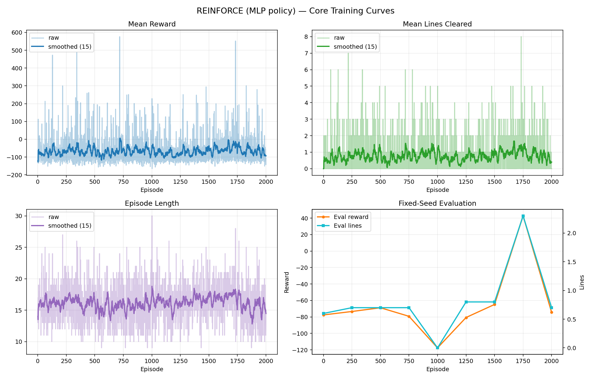

PPO (CNN + linear value) core curves:

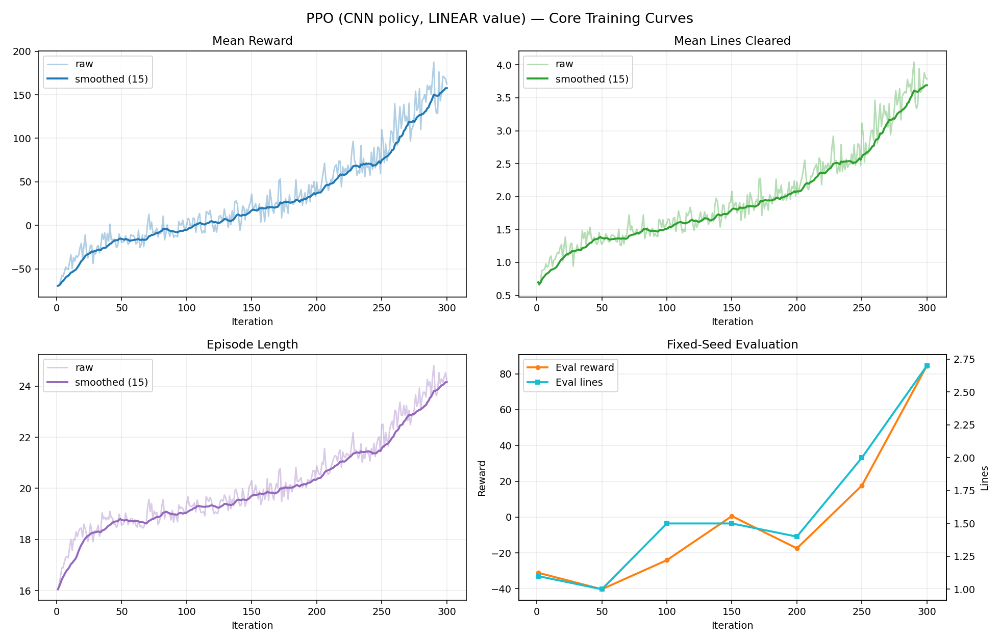

PPO (CNN + MLP value) core curves:

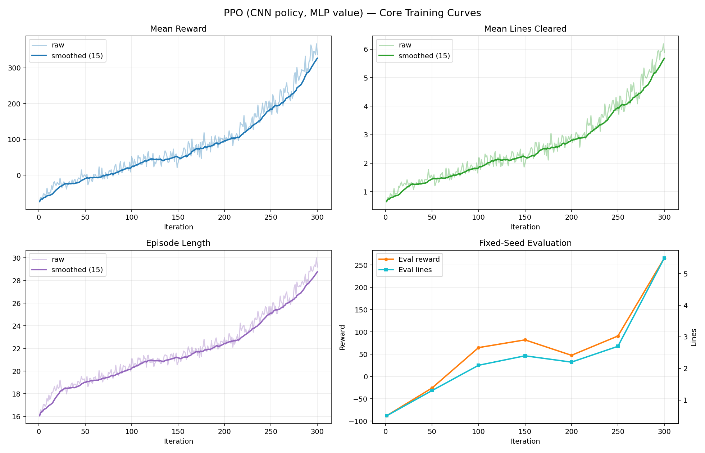

### 11.2 What Changed When Switching Linear -> MLP Critic (PPO)

Keeping PPO policy as CNN and replacing only the critic architecture in the compared runs:

- Reward improved from `162.63` to `337.63` (about `2.08x`).
- Lines improved from `3.79` to `5.89` (about `1.55x`).
- Fixed-seed eval reward improved from `84.56` to `266.06` (about `3.15x`).
- Fixed-seed eval lines improved from `2.70` to `5.50` (about `2.04x`).

Note: this is strong practical evidence, but not a perfectly isolated critic-only ablation, because late-training controls also differ between the two saved runs (for example `target_kl` appears in the MLP-value config).

Critic/stability diagnostics also improved:

- Explained variance (last): `0.130 -> 0.329`.
- Approx KL (last): `0.049 -> 0.014`.
- Clip fraction (last): `0.315 -> 0.118`.
- Ratio max (last): `8.37 -> 4.40`.

Linear-critic diagnostics:

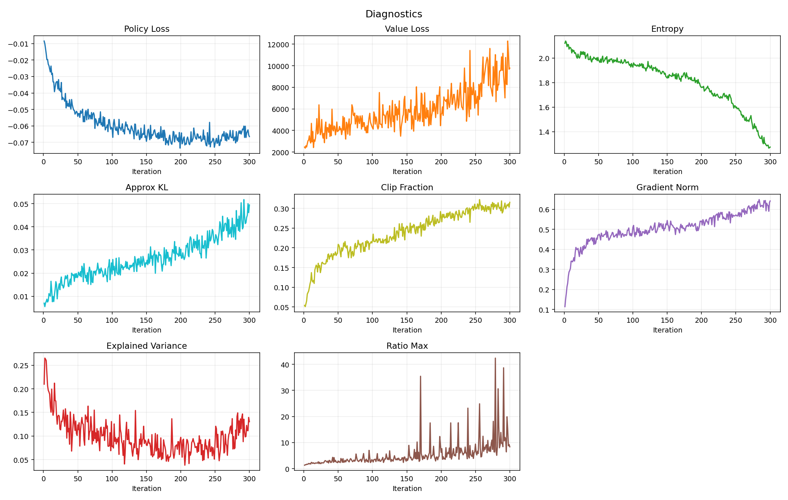

MLP-critic diagnostics:

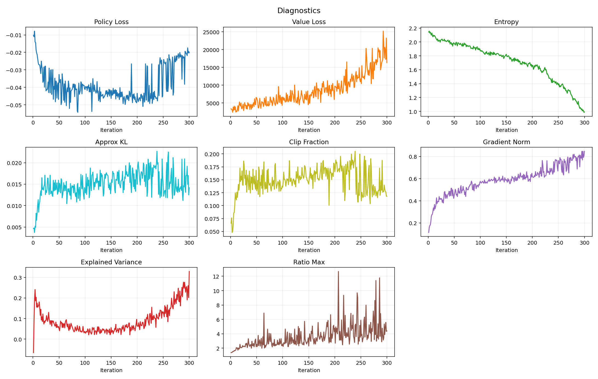

Value calibration (linear critic vs MLP critic):

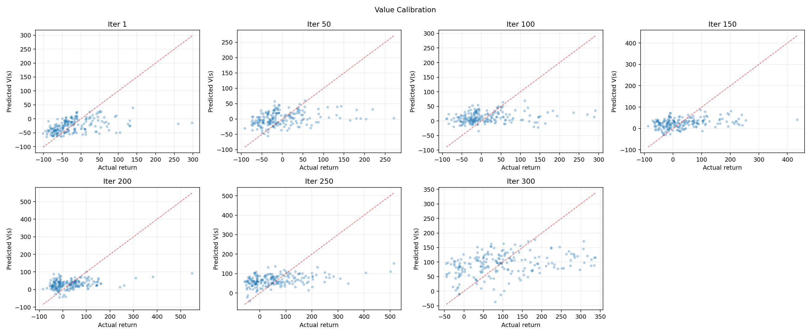

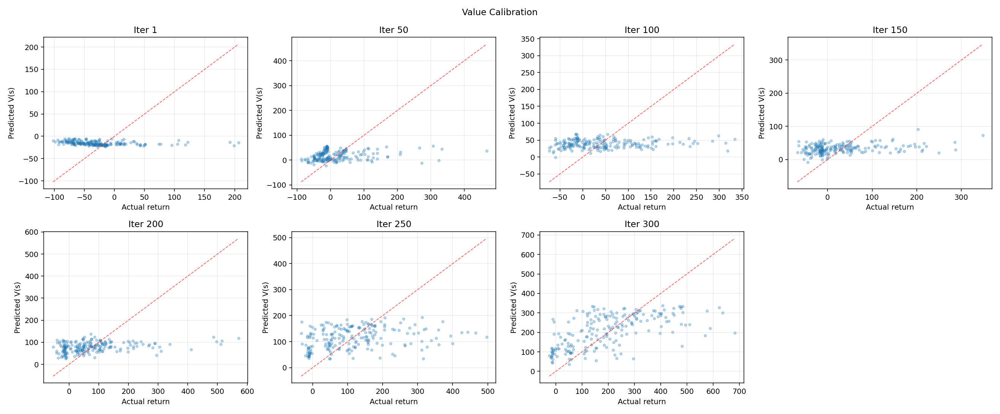

### 11.3 Plot-Based Observations (Current Run)

From the latest core/diagnostic plots:

- Reward, lines, and episode length are still rising at iteration 300 (no clear plateau yet).
- Fixed-seed evaluation shows a strong late improvement near the final checkpoints.
- Value loss increases over time, but explained variance also rises in late training; this indicates larger return scale with improved relative fit, not necessarily critic collapse.
- Entropy decays gradually (toward ~1.0), while KL and clip fraction remain in a conservative range for most late iterations.
- Top-out rate remains high (~0.91), so there is still significant room to improve board safety and long-horizon stability.

Reward decomposition (linear critic vs MLP critic):

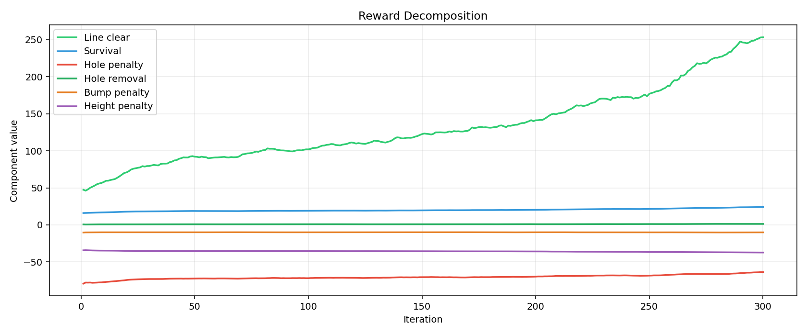

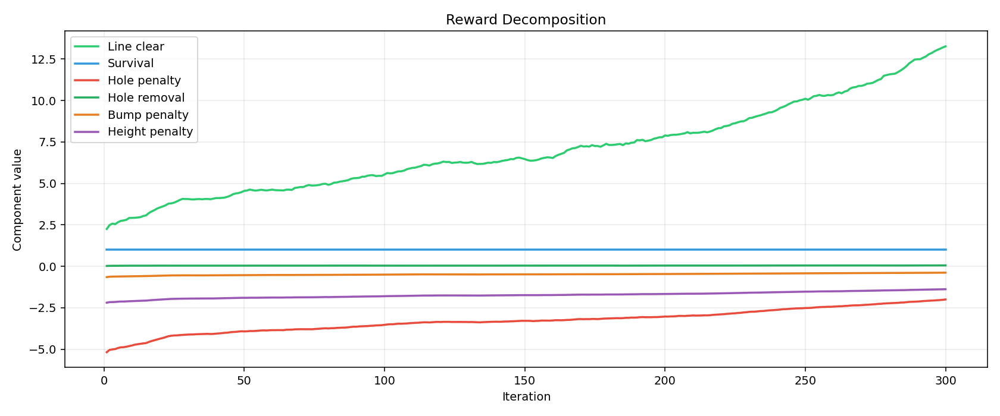

### 11.4 Storytelling Assets Generated

The report pipeline now saves comparison GIFs for qualitative analysis:

- `gif_random_vs_reinforce.gif`
- `gif_reinforce_vs_ppo.gif`

These are embedded directly in report markdown and are generated with a median-performance seed by default for less cherry-picked storytelling.

Random vs REINFORCE (median-seed style storytelling run):

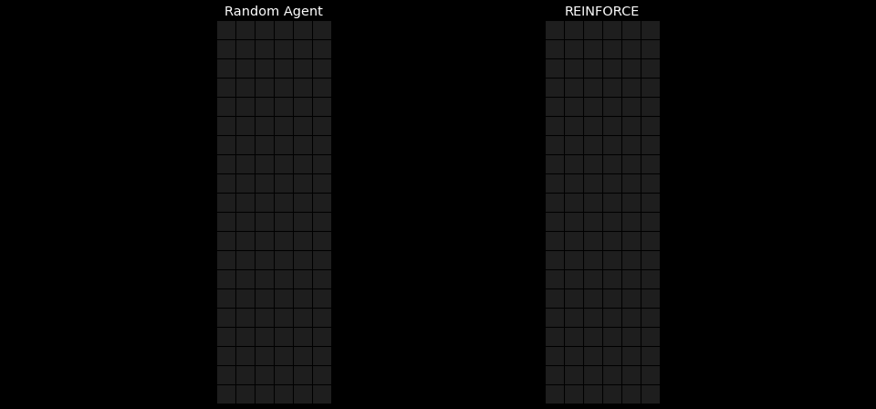

REINFORCE vs PPO:

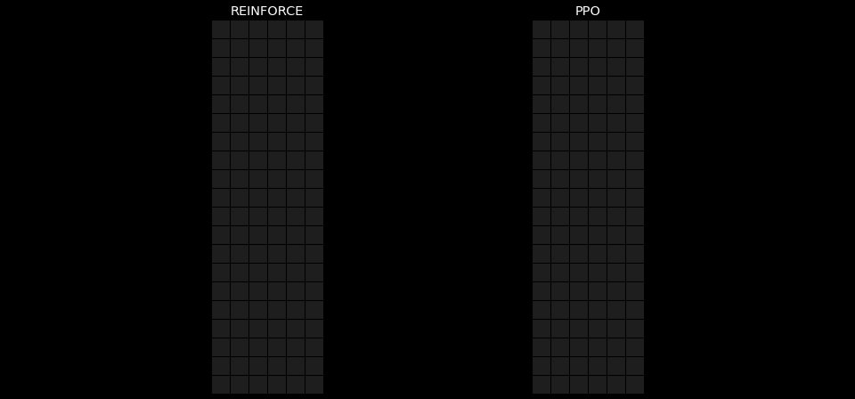
