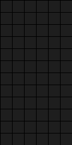
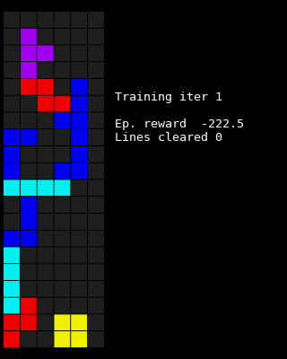
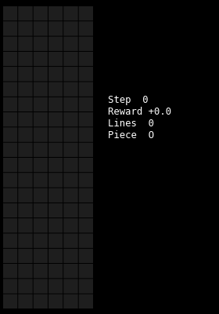
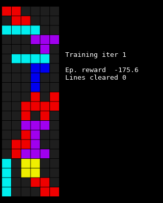
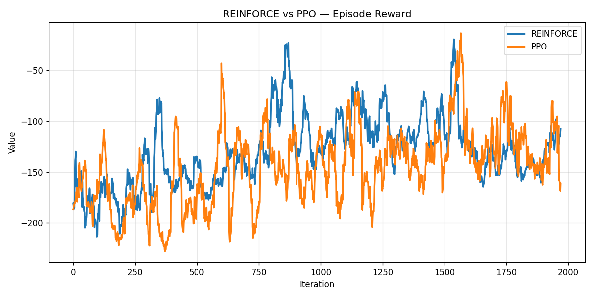
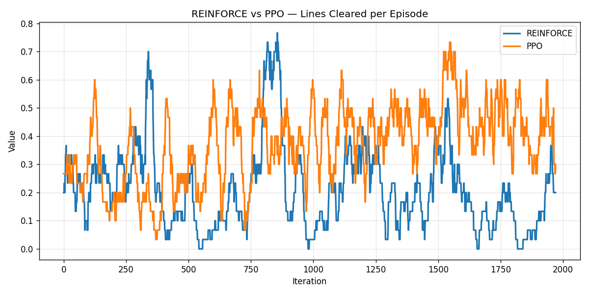
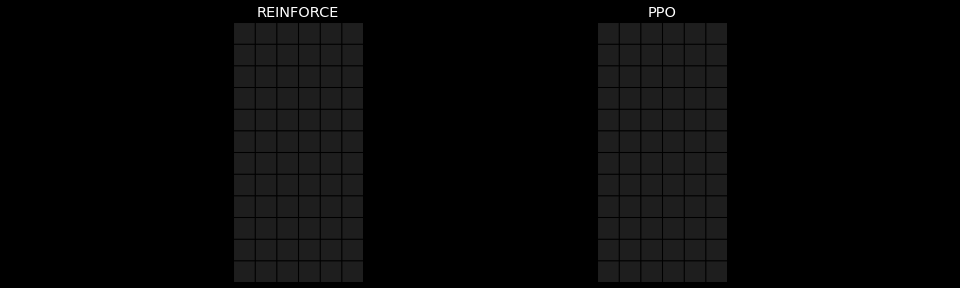
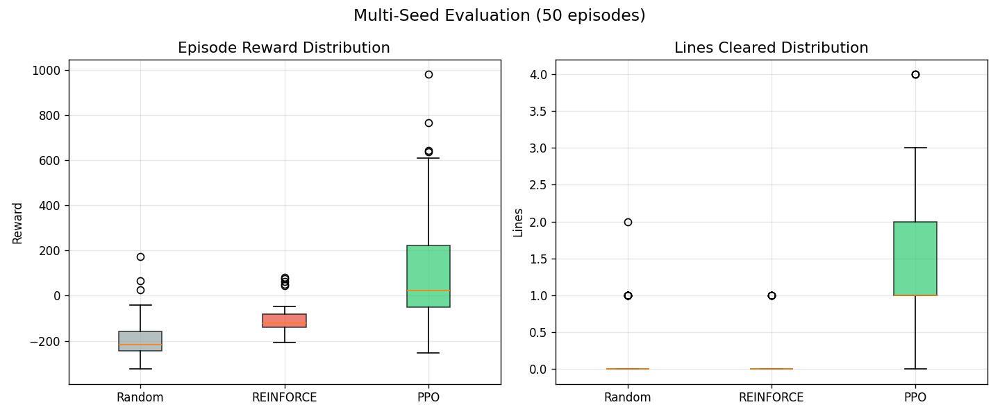

# Tetris-Lite RL

Comparing **REINFORCE** and **PPO** on a simplified Tetris environment, implemented from scratch with NumPy and PyTorch.

## Results

| Agent | Lines cleared (avg ± std) | Episode reward (avg ± std) |
|-------|--------------------------|---------------------------|
| Random | baseline | baseline |
| REINFORCE | see evaluation | see evaluation |
| PPO | see evaluation | see evaluation |

### Random agent


### REINFORCE — training snapshots


### REINFORCE — trained agent


### PPO — training snapshots


### PPO — trained agent


### Learning curves comparison


### Lines cleared comparison


### Side-by-side: REINFORCE vs PPO


### Evaluation (50 seeds)


---

## Environment

`TetrisLiteEnv` — placement-only Tetris (NumPy, no Gymnasium).

- **Board**: 6×20
- **Action**: (rotation, x) flattened → up to 34 discrete actions per step
- **Observation**: height map + holes/col + row fill + scalars + piece one-hot = 33 dims
- **Reward**: line-clear bonus (quadratic) + delta-based shaping (holes, bumpiness, height)
- **Metric**: lines cleared per episode (reward-independent)

## Agents

Both implemented from scratch in PyTorch (no stable-baselines / CleanRL).

### REINFORCE
- Monte-Carlo returns with mean baseline
- Entropy regularisation (annealed 0.05 → 0.002)
- Epsilon-greedy exploration (annealed 0.10 → 0.00)

### PPO
- Clipped surrogate objective + GAE (λ=0.95)
- Shared MLP backbone, separate policy/value heads
- Entropy regularisation (annealed 0.05 → 0.005)
- Epsilon-greedy exploration (annealed 0.10 → 0.00)

## Project structure

```
tetris_env.py                  # Environment (NumPy only)
agents.py                      # REINFORCE + PPO (PyTorch)
visualize.py                   # GIF generation, plots
tetris_rl_visualization.ipynb  # Training + evaluation notebook
gifs/                          # Generated animations and plots
checkpoints/                   # Saved model weights
```

## Requirements

```
numpy torch matplotlib imageio tqdm
```
